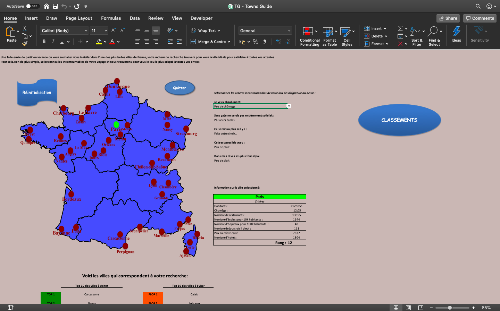
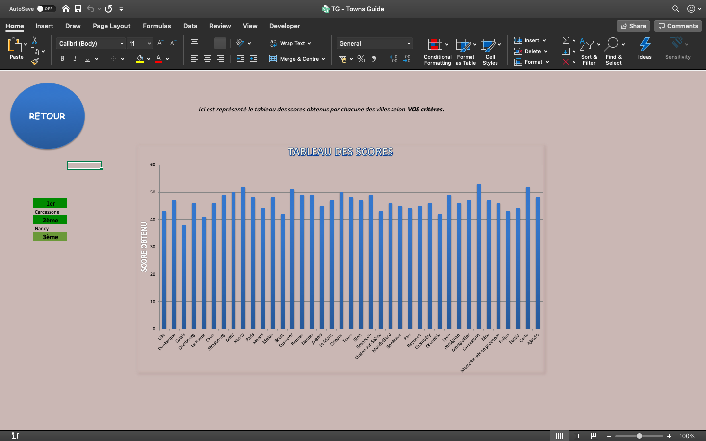
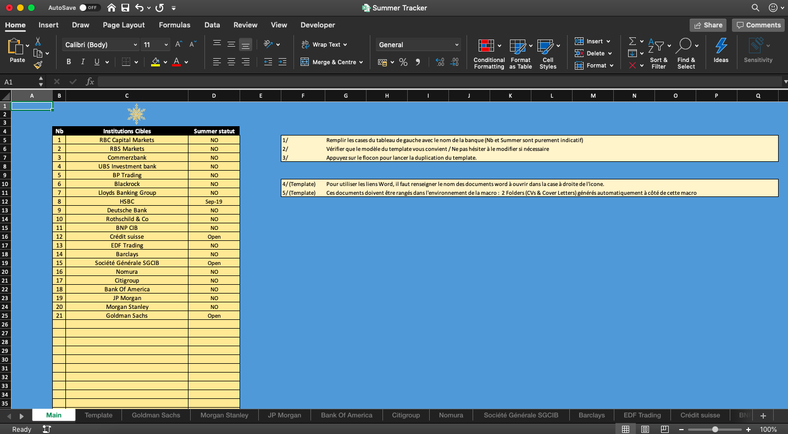
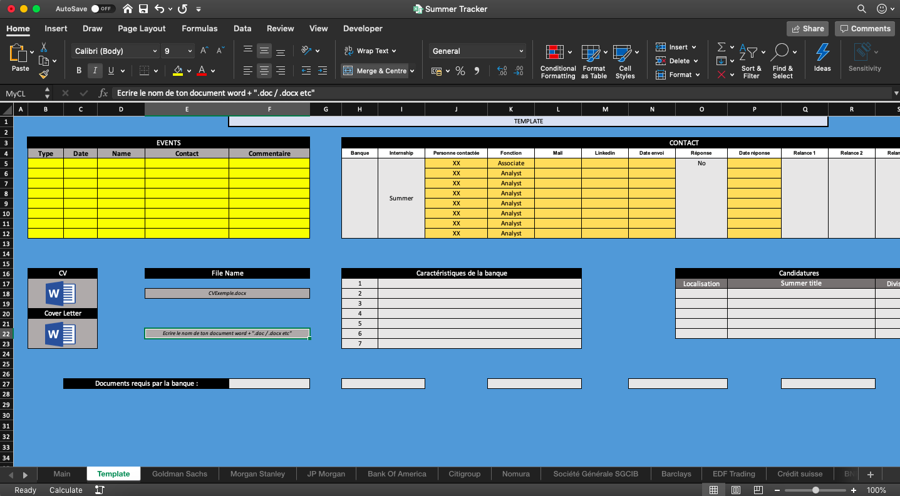

# VBA School projects  

Repository for storing purpose.  
_**School projects : 2016**_

## Towns Guide application

TG is an application to provide users with interactive map displaying main french cities and their ranking based on the criterias the user inputs.  
Therefore, the user is aware of which city fit the best his requirements for living !  
  
  
   

## Summer Tracker  

Tracker application on excel to manage applications to bank's summers. Made for personal use. Must be adapt to a more general purpose.  

